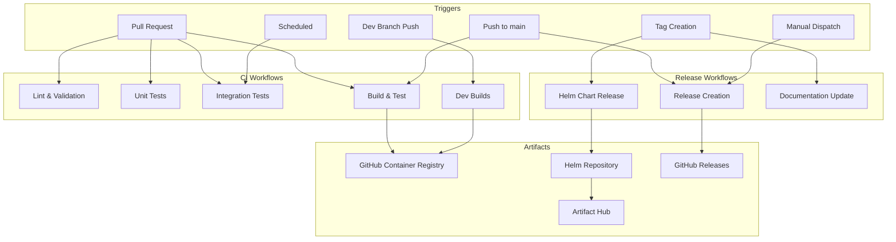
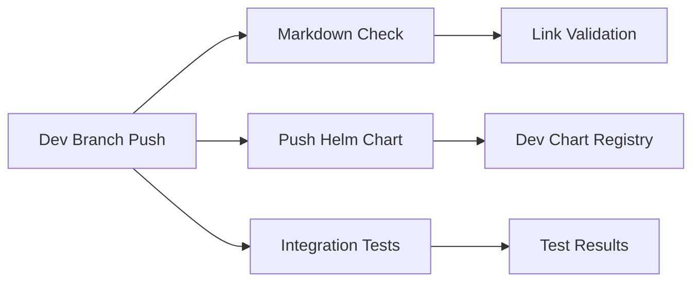
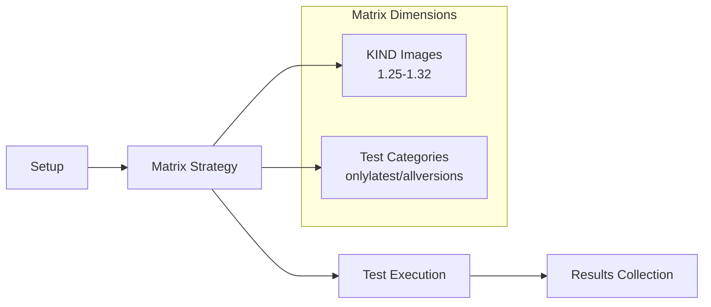
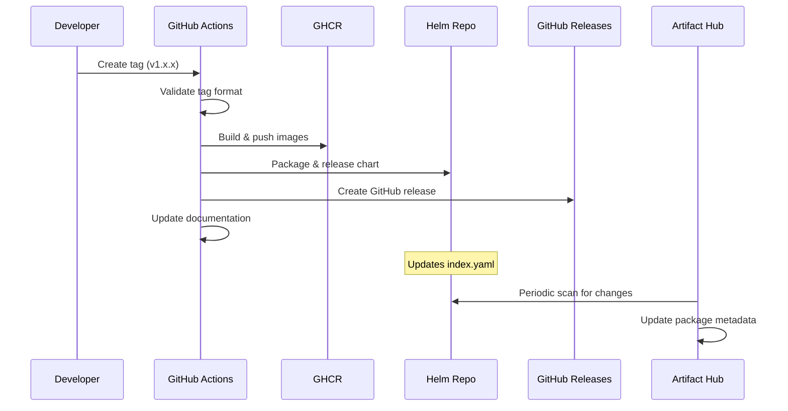
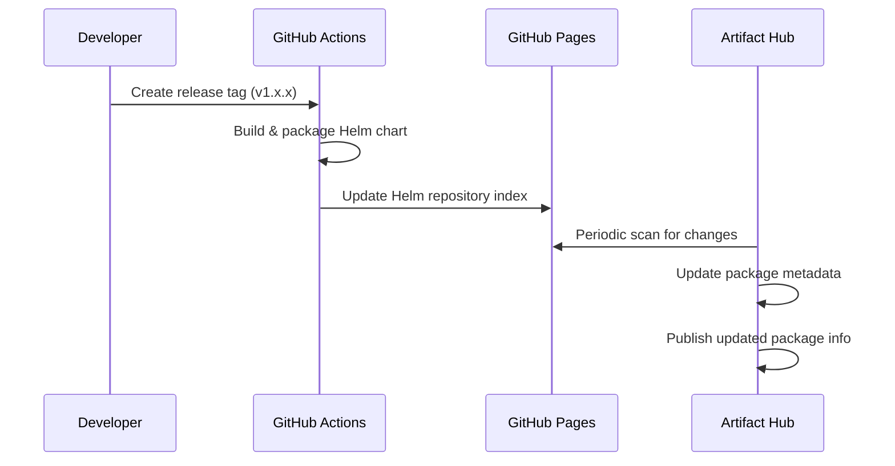
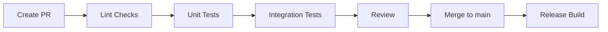
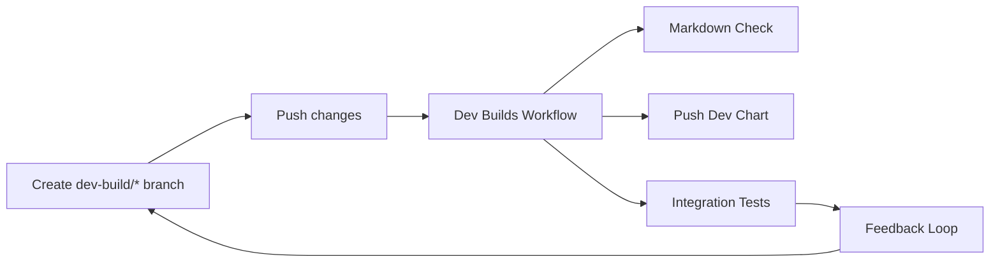

# Build and Release Workflows Documentation

## Overview

This document provides a comprehensive overview of the CI/CD workflows for the Sumo Logic Kubernetes Collection project.

## Workflow Architecture



## Workflow Details

### 1. Dev Builds (`dev_builds.yml`)

**Purpose**: Provides development builds for feature branches and continuous deployment

**Triggers**:
- Push to `dev-build/*` branches
- Push to `main` branch
- Push to `release-v*` branches

**Components**:
- **Markdown Link Check**: Validates documentation links
- **Helm Chart Push**: Publishes development Helm charts
- **Integration Tests**: Runs full integration test suite

**Runner**: Ubuntu 22.04



### 2. Integration Tests (`workflow-integration-tests.yaml`)

**Purpose**: Runs comprehensive integration tests across multiple Kubernetes versions

**Triggers**:
- Pull requests to `main`, `release-*`, `dev` branches
- Push to `main` branch  
- Scheduled: Daily at 2 AM UTC
- Manual dispatch
- Called by dev builds workflow

**Key Features**:
- Matrix testing across multiple KIND images (K8s versions 1.25-1.32)
- Separate test suites for `onlylatest` and `allversions`
- Uses Ubuntu 22.04 runners
- Helm version pinned to 3.18.5

**Artifacts**: Test results and logs



### 3. Build Workflows

**Purpose**: Builds and validates container images and Helm charts

**Triggers**:
- Pull requests
- Push to main
- Tag creation
- Dev branch pushes

**Components Built**:
- OpenTelemetry Collector images
- Setup job images
- Helm charts

**Artifact Storage**:
- Container images: GitHub Container Registry (`ghcr.io`)
- Helm charts: GitHub Releases

### 4. Release Workflows

**Purpose**: Manages versioned releases of the collection

**Triggers**:
- Tag creation (semantic versioning)
- Manual dispatch for hotfixes

**Release Process**:


### 5. Quality Assurance Workflows

**Linting & Validation**:
- YAML validation
- Helm chart linting
- Go code formatting
- Documentation checks
- Markdown link verification

**Security Scanning**:
- Container image vulnerability scanning
- Dependency checking
- SAST analysis

## Environment Configuration

### Helm Version Management

The Helm version is controlled through multiple layers:

1. **CI Environment** (`sumologic/kubernetes-tools:2.22.0` Docker image)
   - Contains Helm v3.18.5
   - Used in build scripts via `ci/_build_functions.sh`

2. **Development Environment** (`shell.nix`)
   - Nix package manager controls local Helm version
   - Version pinned via Nixpkgs commit

3. **Integration Tests**
   - Explicit Helm installation step in GitHub Actions
   - Downloads and installs Helm v3.18.5

### KIND (Kubernetes in Docker) Images

Supported Kubernetes versions defined in `tests/integration/kind_images.json`:

```json
{
  "supported": [
    "kindest/node:v1.32.0@sha256:...",
    "kindest/node:v1.29.0@sha256:...",
    "kindest/node:v1.28.0@sha256:...",
    "kindest/node:v1.27.3@sha256:...",
    "kindest/node:v1.26.6@sha256:...",
    "kindest/node:v1.25.11@sha256:..."
  ],
  "default": "kindest/node:v1.32.0@sha256:..."
}
```

## Artifact Storage Locations

### Container Images
- **Registry**: `ghcr.io/sumologic/sumologic-kubernetes-collection`
- **Components**:
  - `sumologic-otel-collector`
  - `kubernetes-setup`
  - `kubernetes-tools`

### Helm Charts
- **Repository**: [Sumo Logic Kubernetes Collection Helm Repository](https://sumologic.github.io/sumologic-kubernetes-collection/)
- **GitHub Releases**: Packaged as `.tgz` files in [GitHub Releases](https://github.com/SumoLogic/sumologic-kubernetes-collection/releases)
- **Artifact Hub**: [artifacthub.io/packages/helm/sumologic/sumologic](https://artifacthub.io/packages/helm/sumologic/sumologic)
- **Index**: Updated automatically with each release
- **Versioning**: Follows semantic versioning (SemVer)
- **Dev Charts**: Published to development registry for feature testing

#### Artifact Hub Integration

The [Artifact Hub page](https://artifacthub.io/packages/helm/sumologic/sumologic) is updated automatically through the following process:



**Update Process**:
1. **New Release Creation**: When a new tag is created, the release workflow packages the Helm chart and updates the repository index
2. **Artifact Hub Scanning**: Artifact Hub periodically scans the Helm repository at `https://sumologic.github.io/sumologic-kubernetes-collection/index.yaml`
3. **Automatic Updates**: New versions appear on Artifact Hub within 30 minutes to a few hours after release

### Documentation
- **Location**: GitHub Pages (automatically updated)
- **Source**: Generated from Helm chart templates and README files
- **Link Validation**: Automated checking via markdown-link-check

## Development Workflow

### Local Development
1. Use Nix shell environment (`nix-shell`)
2. Run tests locally: `make test`
3. Validate changes: `make lint`

### Pull Request Process


### Dev Branch Workflow


### Release Process
1. Create release tag: `git tag v1.x.x`
2. Push tag: `git push origin v1.x.x`
3. Automated workflows handle:
   - Image building and pushing
   - Helm chart packaging
   - GitHub release creation
   - Documentation updates
   - Artifact Hub synchronization

## Branch Strategy

### Branch Types
- **`main`**: Stable development branch
- **`release-v*`**: Release branches for versioned releases
- **`dev-build/*`**: Development feature branches with automatic builds
- **`dev`**: General development branch

### Workflow Triggers by Branch
| Branch Pattern | Workflows Triggered |
|----------------|-------------------|
| `main` | All workflows (builds, tests, releases) |
| `release-v*` | Dev builds, integration tests |
| `dev-build/*` | Dev builds, integration tests |
| `dev` | Integration tests only |
| Pull Requests | Lint, unit tests, integration tests |

## Monitoring and Troubleshooting

### Workflow Monitoring
- All workflows report status to GitHub Checks
- Failed builds trigger notifications
- Integration test results are archived
- Dev builds provide fast feedback for feature development

### Common Issues
- **Flaky Tests**: Integration tests may fail due to timing issues
- **Resource Limits**: KIND clusters have memory/CPU constraints
- **Version Conflicts**: Ensure Helm and Kubernetes versions are compatible
- **Link Rot**: Markdown links may become invalid over time

### Debugging
- Use `workflow_dispatch` for manual test runs
- Check runner logs for detailed error information
- Review artifact uploads for test results
- Use dev builds for rapid iteration

## Security Considerations

- All container images are scanned for vulnerabilities
- Secrets are managed through GitHub Secrets
- RBAC configurations are validated in integration tests
- Supply chain security through signed containers (when available)
- Dev builds use same security standards as production

## Future Improvements

- Migration to larger GitHub runners for faster builds
- Enhanced caching strategies for dependencies
- Automated performance regression testing
- Multi-architecture image builds (ARM64 support)
- Improved dev build artifact management
- Enhanced integration test parallelization
