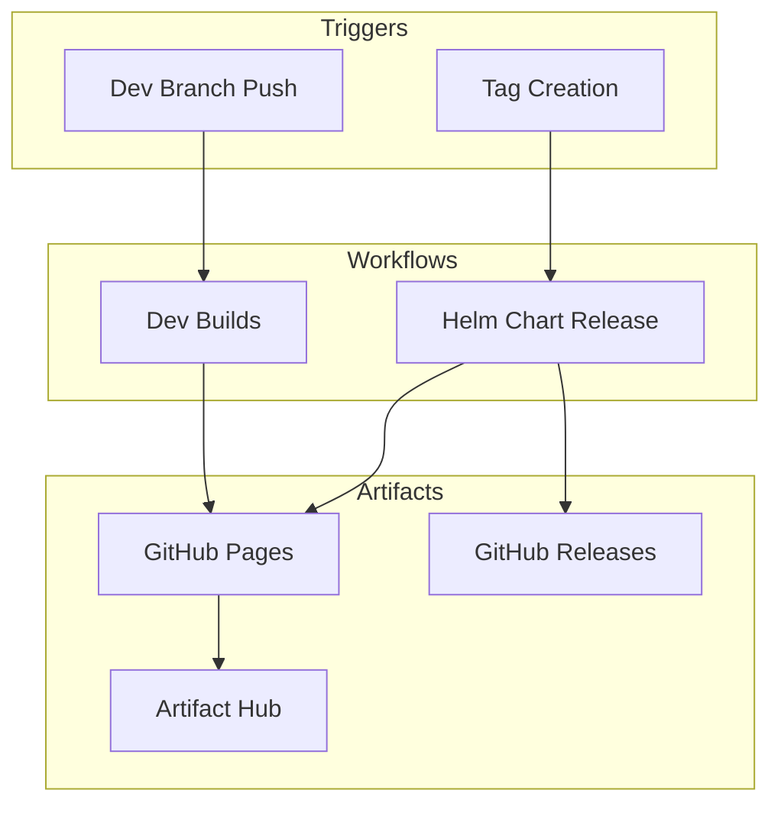
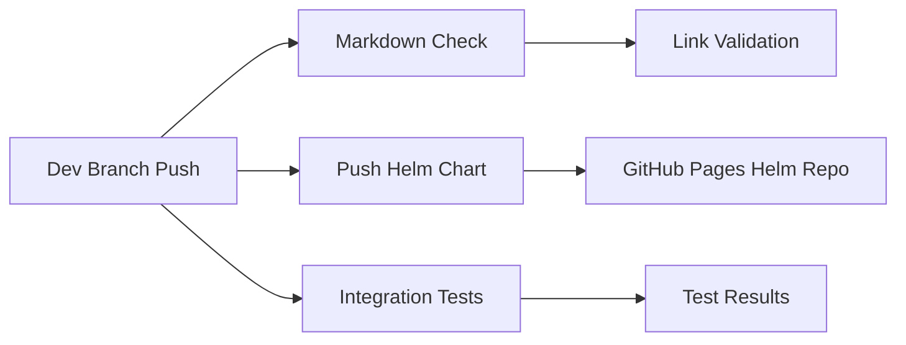
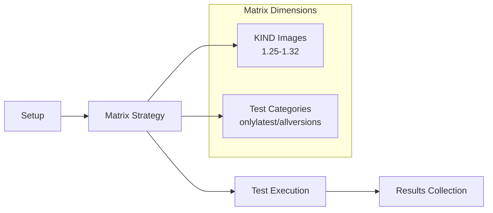
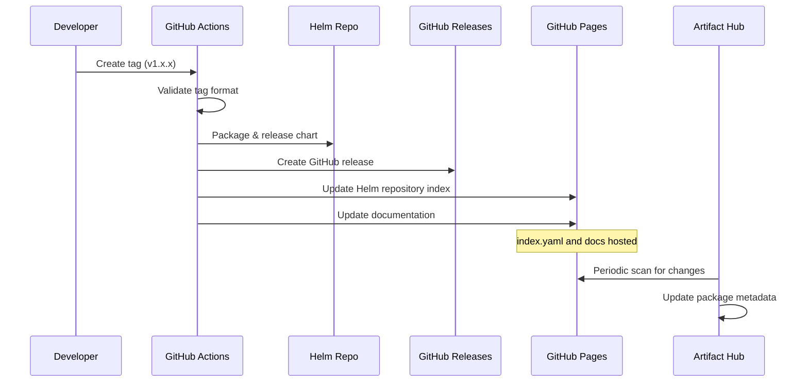
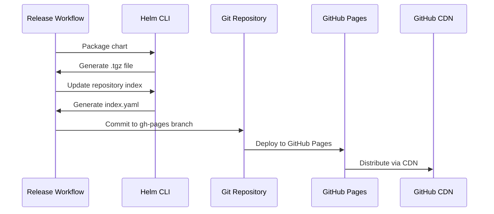
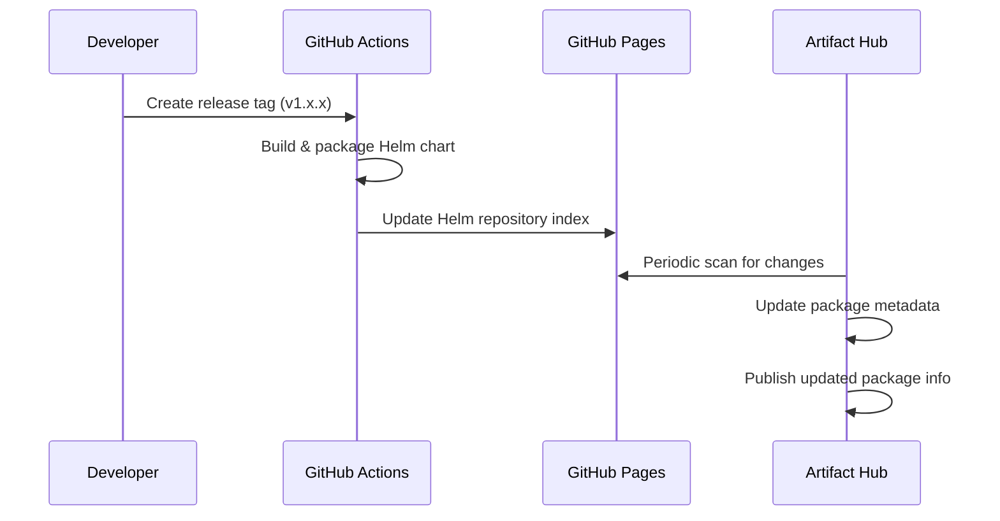

# Build and Release Workflows Documentation

## Overview

This document provides an overview of the CI/CD workflows for Helm chart development and release in the Sumo Logic Kubernetes Collection project.

## Workflow Architecture



## Workflow Details

### 1. Dev Builds (`dev_builds.yml`)

**Purpose**: Provides development Helm chart builds for feature branches and continuous deployment

**Triggers**:
- Push to `dev-build/*` branches
- Push to `main` branch

**Components**:
- **Markdown Link Check**: Validates documentation links
- **Helm Chart Push**: Publishes development Helm charts to GitHub Pages
- **Integration Tests**: Runs full integration test suite

**Runner**: Ubuntu 22.04



### 2. Integration Tests (`workflow-integration-tests.yaml`)

**Purpose**: Runs comprehensive integration tests across multiple Kubernetes versions

**Triggers**:
- Pull requests to `main`, `release-*`, `dev` branches
- Push to `main` branch  
- Called by dev builds workflow

**Key Features**:
- Matrix testing across multiple KIND images (K8s versions 1.25-1.32)
- Separate test suites for `onlylatest` and `allversions`
- Uses Ubuntu 22.04 runners
- Helm version pinned to 3.18.5

**Artifacts**: Test results and logs



### 4. Release Workflows

**Purpose**: Manages versioned releases of the Helm chart collection

**Triggers**:
- Tag creation (semantic versioning)
- Manual dispatch for hotfixes

**Release Process**:


### KIND (Kubernetes in Docker) Images

Supported Kubernetes versions defined in `tests/integration/kind_images.json`:

```json
{
  "supported": [
    "kindest/node:v1.32.0@sha256:...",
    "kindest/node:v1.29.0@sha256:...",
    "kindest/node:v1.28.0@sha256:...",
    "kindest/node:v1.27.3@sha256:...",
    "kindest/node:v1.26.6@sha256:...",
    "kindest/node:v1.25.11@sha256:..."
  ],
  "default": "kindest/node:v1.32.0@sha256:..."
}
```

## Artifact Storage Locations

### Helm Charts
- **Repository**: [Sumo Logic Kubernetes Collection Helm Repository](https://sumologic.github.io/sumologic-kubernetes-collection/)
- **GitHub Releases**: Packaged as `.tgz` files in [GitHub Releases](https://github.com/SumoLogic/sumologic-kubernetes-collection/releases)
- **Artifact Hub**: [artifacthub.io/packages/helm/sumologic/sumologic](https://artifacthub.io/packages/helm/sumologic/sumologic)
- **Index**: Updated automatically with each release
- **Versioning**: Follows semantic versioning (SemVer)
- **Dev Charts**: Published to GitHub Pages for feature testing

### GitHub Pages Artifact Storage

GitHub Pages serves as the primary hosting platform for the Helm repository and project documentation:

#### Helm Repository on GitHub Pages
- **URL**: `https://sumologic.github.io/sumologic-kubernetes-collection/`
- **Contents**:
  - `index.yaml`: Helm repository index containing chart metadata
  - Chart packages: `.tgz` files for each released version
  - Repository metadata and configuration files

#### GitHub Pages Deployment Process



#### Files Stored on GitHub Pages
1. **Helm Repository Index** (`index.yaml`):
   ```yaml
   apiVersion: v1
   entries:
     sumologic:
       - name: sumologic
         version: 4.10.0
         urls:
           - https://sumologic.github.io/sumologic-kubernetes-collection/sumologic-4.10.0.tgz
         digest: sha256:...
         created: "2024-01-15T10:30:00Z"
   ```

2. **Chart Packages**: Compressed `.tgz` files containing:
   - Chart templates
   - Values files
   - Chart metadata
   - Documentation

3. **Repository Metadata**:
   - Repository configuration
   - Security policies
   - Access control information

#### GitHub Pages Configuration
- **Branch**: `gh-pages` (automatically managed by workflows)
- **Build Source**: Deploy from a branch
- **Custom Domain**: Not configured (uses default GitHub Pages URL)
- **HTTPS**: Enforced by default
- **CDN**: Automatically distributed via GitHub's global CDN

#### Deployment Workflow via `push_helm_chart` Function

The GitHub Pages deployment is handled by the `push_helm_chart` function in `ci/_build_functions.sh`:

1. **Chart Packaging**: 
   ```bash
   helm package deploy/helm/sumologic --dependency-update --version="${version}" --app-version="${version}" --destination "${sync_dir}"
   ```

2. **Index Update**: 
   ```bash
   helm repo index --url "https://sumologic.github.io/sumologic-kubernetes-collection${chart_dir:1}/" --merge "${chart_dir}/index.yaml" "${sync_dir}"
   ```

3. **Branch Management**: 
   ```bash
   git checkout -B gh-pages "${remote}/gh-pages"
   ```

4. **Pages Deployment**: 
   ```bash
   git push "${remote}" gh-pages
   ```

5. **CDN Distribution**: Content is distributed globally via GitHub's CDN

#### Artifact Hub Integration

The [Artifact Hub page](https://artifacthub.io/packages/helm/sumologic/sumologic) is updated automatically through the following process:



**Update Process**:

1. **New Release Creation**: When a new tag is created, the release workflow packages the Helm chart and updates the repository index
2. **GitHub Pages Update**: The `index.yaml` file is updated on GitHub Pages with new chart metadata
3. **Artifact Hub Scanning**: Artifact Hub periodically scans the Helm repository at `https://sumologic.github.io/sumologic-kubernetes-collection/index.yaml`
4. **Automatic Updates**: New versions appear on Artifact Hub within 30 minutes to a few hours after release

### Documentation

- **Location**: GitHub Pages (automatically updated)
- **URL**: Same as Helm repository (`https://sumologic.github.io/sumologic-kubernetes-collection/`)
- **Source**: Generated from Helm chart templates and README files
- **Link Validation**: Automated checking via markdown-link-check

## Development Workflow

### Local Development

1. Use Vagrant
2. Run tests locally: `make test`
3. Validate charts: `make lint`
4. Test chart templates: `helm template`

## Branch Strategy

### Branch Types

- **`main`**: Stable development branch
- **`release-v*`**: Release branches for versioned releases
- **`dev-build/*`**: Development feature branches with automatic builds
- **`dev`**: General development branch
- **`gh-pages`**: GitHub Pages deployment branch (automatically managed)

### Workflow Triggers by Branch
| Branch Pattern | Workflows Triggered |
|----------------|-------------------|
| `main` | All workflows (builds, tests, releases) |
| `release-v*` | Dev builds, integration tests |
| `dev-build/*` | Dev builds, integration tests |
| `dev` | Integration tests only |
| `gh-pages` | GitHub Pages deployment (automatic) |
| Pull Requests | Lint, chart validation, integration tests |

## Common Issues

- **Flaky Tests**: Integration tests may fail due to timing issues
- **Resource Limits**: KIND clusters have memory/CPU constraints
- **Version Conflicts**: Ensure Helm and Kubernetes versions are compatible
- **Chart Template Errors**: Invalid YAML or missing values can cause deployment failures
